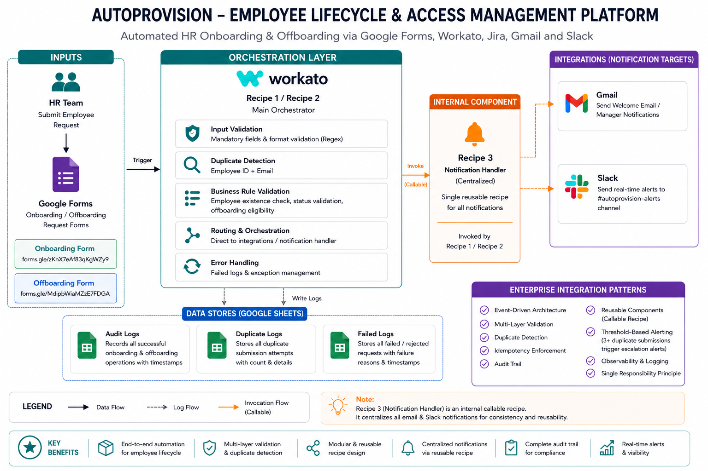

# AutoProvision — Automated Employee Lifecycle & Access Management Platform

## Overview
AutoProvision is an enterprise-grade employee lifecycle automation platform built on Workato. It automates the complete onboarding and offboarding workflow — from HR form submission to Jira ticket creation, email notifications, Slack alerts, and audit logging — with multi-layer validation, duplicate detection, and centralized notification handling.

## Business Problem
HR teams manually provision and deprovision employee access across multiple systems, leading to:
- Delayed system access for new employees
- Security risks from delayed access revocation
- No audit trail for compliance
- Human errors in data entry

AutoProvision solves all of this through automated, event-driven integrations.

## Architecture

## Workflow
### Onboarding
1. HR submits Google Form
2. Real-time trigger fires Workato Recipe 1
3. Multi-layer validation (mandatory fields + format checks)
4. Duplicate detection (Employee ID + Email)
5. Jira onboarding ticket created
6. Welcome email sent to employee + manager
7. Slack notification posted to #autoprovision-alerts
8. Record logged to Audit Log

### Offboarding
1. HR submits Offboarding Google Form
2. Workato Recipe 2 triggered (polling, every 5 min)
3. Employee existence + status validation
4. Multi-layer format validation
5. Jira offboarding ticket created with access revocation checklist
6. Manager notified via email
7. Slack alert posted to #autoprovision-alerts
8. Audit Log updated (Status → Offboarded, Updated Time recorded)

## Recipes
| Recipe | Description |
|---|---|
| 01 - Employee Onboarding Trigger | Handles end-to-end onboarding workflow |
| 02 - Employee Offboarding Trigger | Handles end-to-end offboarding workflow |
| 03 - Notification Handler | Centralized callable recipe for all notifications |

## Tech Stack
| Tool | Purpose |
|---|---|
| Workato | iPaaS orchestration platform |
| Google Forms | HR input trigger (onboarding + offboarding) |
| Google Sheets | Audit Logs, Duplicate Logs, Failed Logs |
| Jira Cloud | Ticket creation for onboarding/offboarding tasks |
| Gmail | Employee welcome emails + manager notifications |
| Slack | Real-time alerts to #autoprovision-alerts |
| Postman | API testing and webhook simulation |

## Key Features
- ✅ Real-time Google Forms trigger for onboarding
- ✅ Multi-layer input validation (mandatory fields + regex format checks)
- ✅ Dual duplicate detection (Employee ID + Email)
- ✅ Threshold-based duplicate alerting (3+ attempts → escalation)
- ✅ Centralized notification handler (callable recipe pattern)
- ✅ Dead letter logging (Failed Logs + Duplicate Logs)
- ✅ Complete audit trail (Audit Logs with timestamps)
- ✅ Idempotency checks (cannot onboard/offboard same employee twice)
- ✅ Single Responsibility Principle (validation → orchestration → notification)
- ✅ Start date validation enforced at Google Form level (date picker restricted to future dates)

## Integration Concepts Demonstrated
- Webhook and event-driven triggers
- Callable recipes (reusable components)
- Conditional branching and routing
- Regex-based data validation
- Dead letter queue pattern
- Idempotency enforcement
- Audit logging and observability
- Threshold-based alerting

## Screenshots

### Onboarding — Happy Path

### Failed Validation

### Duplicate Detection

### Offboarding — Happy Path

### Recipe Structure

## Sample Payloads
See [sample-payloads/](sample-payloads/) folder for onboarding and offboarding JSON payloads.

## Resume Description
Built **AutoProvision**, an enterprise employee lifecycle automation platform on Workato integrating Google Forms, Jira, Gmail, Slack, and Google Sheets to automate onboarding and offboarding workflows with multi-layer validation, duplicate detection with threshold alerting, centralized notification handling via callable recipes, and comprehensive audit logging following dead letter queue and idempotency patterns.
